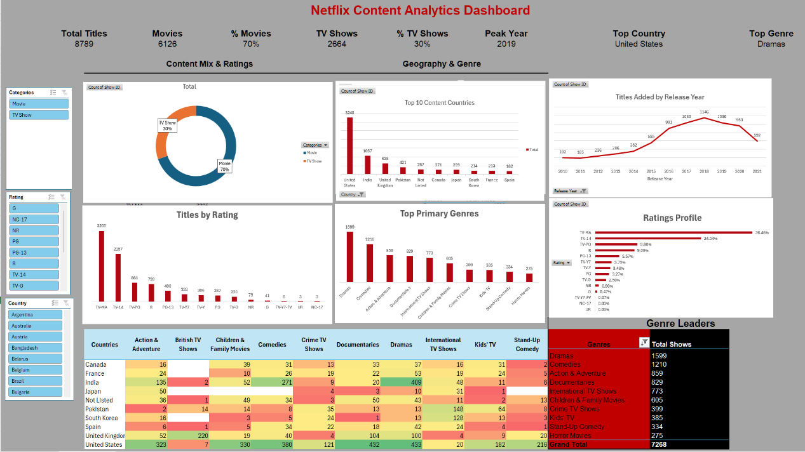

# Netflix Content Analytics Dashboard

## 📊 Overview
Comprehensive Excel-based analysis of Netflix titles dataset (8,791 records). Covers data cleaning, feature engineering, univariate/bivariate analysis, and interactive dashboard creation.

## 🛠️ Features
- **Data Cleaning**: Null handling, date parsing, duration splitting, primary category extraction
- **Dashboard**: 6 live charts + slicers (Type, Rating, Country)
- **Key Insights**:
  - Movies 70%, TV Shows 30%
  - US + India dominate (45% + 12%)
  - Dramas/Comedies lead genres
  - TV-MA skew (adult-focused)

## 📈 Analysis Phases
1. **Data Prep**: Cleaned 10 columns (title→sub-categories)
2. **Univariate**: Type, Country, Genre, Rating, Year trends
3. **Bivariate**: Country×Genre heatmap, Rating×Type
4. **Dashboard**: Pivot-powered, slicer-connected visuals
5. **Business Insights**: Content strategy recommendations

## 🗂️ Files
**Core:**
- `dashboard/Netflix_Analysis_Dashboard.xlsx` ← Interactive charts + slicers
- `dashboard/Netflix_Data_Analysis_Report.pdf` ← Printable version
- `visuals/netflix_dashboard.png` ← Screenshot

**Data:**
- `data/netflix1.csv` ← Raw (8.7K titles)
- `data/netflix.csv` ← Cleaned + engineered

**Analysis:**
- `analysis/` ← Phase 4-6 detailed workbooks

## 📊 Dashboard Screenshots
![Dashboard]

## File Structure
```
netflix-content-analysis/
│
├── 📁 data/                           # Raw + Clean Data
│   ├── netflix1.csv                   # Original raw dataset
│   ├── netflix_v1.csv                 # Intermediate clean
│   └── netflix.csv                    # Final cleaned dataset
│
├── 📁 analysis/                       # Phase-by-phase work
│   ├── netflix_data_v0.xlsx           # Pre-cleaning backup
│   ├── netflix_data_univariate_analysis.xlsx
│   ├── netflix_data_bivariate_analysis.xlsx
│   ├── netflix_top_performers.xlsx
│   └── netflix_eda_notes.xlsx         # Analysis documentation
│
├── 📁 dashboard/                      # MAIN DELIVERABLE ⭐
│   ├── Netflix_Analysis_Dashboard.xlsx  # Interactive dashboard
│   └── Netflix_Data_Analysis_Report.pdf # PDF export
│
├── 📁 visuals/                        # Screenshots
│   └── netflix_dashboard.png          # Dashboard screenshot
│
├── 📄 README.md                       # Project overview + instructions
└── 📄 LICENSE                         # MIT License
```
## 🎯 Business Takeaways
- **Movie-heavy** → Invest in TV for retention
- **Adult-skewed** → Expand family content
- **US/India focus** → Regional personalization
- **2016 peak** → Quality > quantity phase

## 🔧 Usage
1. Open `netflix_data.xlsx`
2. Use slicers to filter by Type/Rating/Country
3. All charts update live
4. Export Dashboard → PDF for reports

## 📝 Analysis Credits
Built following structured 8-phase methodology:
- Phase 1-3: Data cleaning/feature engineering
- Phase 4-6: Univariate/bivariate/top performers  
- Phase 7-8: Dashboard + export

---
*Netflix Content Strategy Insights | March 2026*
